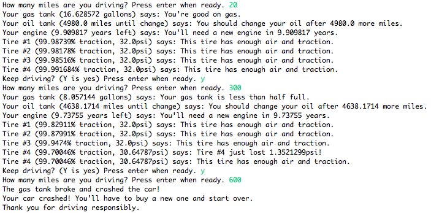

## Project

### Web Programming Project
* Node.js를 활용한 프로젝트 [api-test-with-node.js](https://github.com/kyhoon001/api-test-with-node.js)
- Node.js, express를 이용해 웹 서버를 구성하였습니다. habdlebars 라이브러리를 이용하여 템플릿을 구성하였으며, 공공데이터 API를 사용하여 해당 페이지에서 약품 정보를 검색할 수 있습니다. 회원가입, 게시글 등록과 같은 데이터들은 mongoDB를 활용하여 저장하였습니다. passport.js를 사용하여 사용자 인증과 같은 로그인, 회원가입 등의 데이터를 관리하였습니다.
- 해당 프로젝트는 windows10 환경에서 Brackets, Robo 3t를 활용하여 작업했습니다.

* Spring을 활용한 프로젝트 [빅데이터를 활용한 IoT시스템 개발 과정 Semi-Project](https://github.com/kyhoon001/semi-test)
- Spring Framework와 Maven을 활용하여 웹 페이지를 만들었습니다. eclipse 에디터를 사용하여 작업하였으며, 톰캣 서버를 활용하여 서버를 구성하였습니다. DB는 OracleDB를 활용하였습니다. 현재는 IoT 관련 장비를 판매하는 쇼핑몰을 컨셉으로 제작되었습니다. 이후에 진행될 IoT 프로젝트에서 해당 결과물의 관제시스템을 탑제할 예정입니다. 해당 프로젝트의 템플릿은 bootstrap을 활용하여 만들었습니다.

-----------------

## Languages
* 학부 과정에서 C++, Java, JavaScripts를 비롯한 웹 프로그래밍관련 언어를 학습하였습니다.
* 멀티캠퍼스 교육과정을 통해 python을 학습하였습니다. 해당 학습 과제로 python을 활용한 간단한 텔레그램 봇을 만드는 과제를 수행했습니다. 해당 봇은 파파고 API를 사용하여 번역을 해주는 기능을 수행하며, pythonanywhere를 통해 배포되었습니다.

-----------------

## Full Stack

### Java
* Implement the Model-View-Controller pattern in a full-stack web app
* Design an Entity Relationship Diagram (ERD) to describe database structure
* Use a DAO interface to send prepared statements to a PostgreSQL database

### Google, Udacity
* Win a [scholarship](https://www.udacity.com/grow-with-google) (Jan. to April 2018) to learn full stack mobile-first development techniques and patterns (such as offline-first for slow connections)

### WordPress
* Deploy WordPress manually to Heroku and connect it to an Amazon RDS instance running MySQL. (I later [switched](http://www.mild-mandarin.com/) to GreenGeeks because Heroku's ephemeral file system isn't best suited for WordPress.)
* Configure SSL between the database and Heroku with keys and passwords stored in Heroku Config Variables
* [Deploy WordPress](http://www.mild-mandarin.com/) using a hosting provider such as GreenGeeks

-----------------

## Object-oriented Programming

* I work equally well with class-based inheritance (e.g., Java) and JavaScript's prototypal inheritance.
* I know how ES6's illusion of class-based inheritance works under the hood.
* I can [build a car](https://github.com/chrisbobbe/java-car) from scratch with Java classes and interfaces:

-----------------

## Other

### I make myself more productive with code
* I use the Gmail API to [keep my mail neat](https://gist.github.com/chrisbobbe/072add64f2254c7a22b21b77eceb874c)
* I made a [custom TypeScript app in IFTTT](https://gist.github.com/chrisbobbe/4d2f79af65efdfa31e49bf00f983c779) that connects my Fitbit with the productivity tracker Beeminder to make sure I sleep enough

### I did a 12-week batch at the [Recurse Center](https://www.recurse.com/), writing code full-time
* I grew by immersion in conversations beyond my level
* I learned to [ask good questions and push myself](https://www.recurse.com/manual)
* I spent lots of time learning JavaScript properly (ES5 and ES6)
* I pair programmed on a [Fortune's Algorithm (Voronoi diagram) implementation in C++](https://github.com/mtn/voronoi) for three weeks
* I studied machine learning theory

### Well-rounded formal education:
* [B.A., English, Haverford College](https://www.haverford.edu/english) with three CS classes
* [High School Diploma, North Carolina School of Science and Mathematics](https://www.ncssm.edu/)

-----------------

## Online coursework:

### I spend hundreds of hours doing hands-on projects from online courses and books
  * [Grow with Google Challenge Scholarship: Mobile Web Specialist Track](https://www.udacity.com/grow-with-google), where I made an app offline-first and refreshed my ES6
  * [RevaturePro project: PubHub](https://app.revature.com), a six-dive project using Java, HTML/CSS, SQL, JDBC, Servlets, and JSPs
  * [Udacity: Web Development](https://classroom.udacity.com/courses/cs253)
  * [Eloquent JavaScript](http://eloquentjavascript.net/), online book by Marijn Haverbeke with interactive exercises
  * [Codecademy: Learn ReactJS Part I](https://www.codecademy.com/learn/react-101)
  * [Codecademy: Learn ReactJS Part II](https://www.codecademy.com/learn/react-102)
  * [Codecademy: Learn AngularJS 1.X](https://www.codecademy.com/learn/learn-angularjs)
  * [Codecademy: Learn Responsive Design](https://www.codecademy.com/learn/learn-responsive-design)
  * [Lynda: Accessibility for Web Design](https://www.lynda.com/Web-Design-tutorials/Accessibility-Web-Design/606090-2.html)
  * [Head First Java](http://www.headfirstlabs.com/books/hfjava/), book by Bert Bates and Kathy Sierra
  * [Udemy: Learn Ethical Hacking from Scratch](https://www.udemy.com/learn-ethical-hacking-from-scratch/)
  * [Coursera: Machine Learning](https://www.coursera.org/learn/machine-learning)
  * Many individual tutorials and crash courses on YouTube
